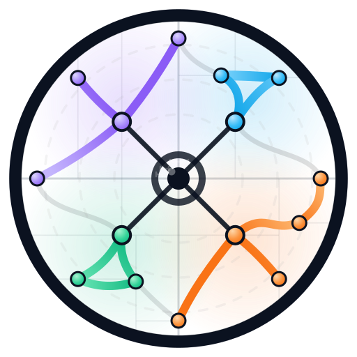

<h1 align="center"></h1>

<h3 align="center">Structural variation aggregation</h3>

Svx is a merging tool for structural variations (SVs) and copy number variations (CNVs) called by [sawfish](https://github.com/PacificBiosciences/sawfish) from PacBio HiFi sequencing data. Svx is largely inspired by [Jasmine](https://github.com/mkirsche/Jasmine), which frames multi-sample SV merging as a graph problem and uses a modified minimum-spanning-forest strategy to merge analogous variants across samples. Svx follows the same high-level philosophy while implementing its own Rust-native merge engine and constraints. Beyond the core merge algorithm, svx includes many ergonomic features, a few examples: built-in parallelization across (and within) contigs, TR support, global sorting on output, easy run scoping by contig and region, and selection of SV classes to include in the merge.

## Early version warning

This is an **early** release of svx and is under development. Expect breaking changes at **all** levels, data formats, and system behavior.

### Limitations

- Currently **only** the [sawfish](https://github.com/PacificBiosciences/sawfish) SV/CNV calling tool is supported.

## Version information

Current version: **0.6.0**.

For a complete changelog, see the [changelog](CHANGELOG.md) or the git history.

## Availability

- The latest svx Linux binary is [available here](https://github.com/PacificBiosciences/svx/releases)

## Documentation

- [Documentation index](docs/index.md)
- [Usage guide](docs/guide.md)
- [Tuning and defaults](docs/tuning.md)
- [Output interpretation](docs/output.md)
- [TR containment](docs/tr_containment.md)
- [Merge constraints](docs/merge_constraints.md)
- [Command line interface (generated reference)](docs/cli.md)

## Need help?

If you notice any missing features, bugs, or need assistance with analyzing the
output of svx, please do not hesitate to [reach out by email](mailto:tmokveld@pacificbiosciences.com)
or open a GitHub issue.

## Support information

Svx is currently in active development and is intended for research use only and not for use
in diagnostic procedures. While efforts have been made to ensure that svx
lives up to the quality that PacBio strives for, we make no warranty regarding
this software.

As svx is not covered by any service level agreement or the like, please do
not contact a PacBio Field Applications Scientists or PacBio Customer Service
for assistance with any svx release. Please report all issues through GitHub
instead. We make no warranty that any such issue will be addressed, to any
extent or within any time frame.

### DISCLAIMER

THIS WEBSITE AND CONTENT AND ALL SITE-RELATED SERVICES, INCLUDING ANY DATA, ARE
PROVIDED "AS IS," WITH ALL FAULTS, WITH NO REPRESENTATIONS OR WARRANTIES OF ANY
KIND, EITHER EXPRESS OR IMPLIED, INCLUDING, BUT NOT LIMITED TO, ANY WARRANTIES
OF MERCHANTABILITY, SATISFACTORY QUALITY, NON-INFRINGEMENT OR FITNESS FOR A
PARTICULAR PURPOSE. YOU ASSUME TOTAL RESPONSIBILITY AND RISK FOR YOUR USE OF THIS
SITE, ALL SITE-RELATED SERVICES, AND ANY THIRD PARTY WEBSITES OR APPLICATIONS. NO
ORAL OR WRITTEN INFORMATION OR ADVICE SHALL CREATE A WARRANTY OF ANY KIND. ANY
REFERENCES TO SPECIFIC PRODUCTS OR SERVICES ON THE WEBSITES DO NOT CONSTITUTE OR
IMPLY A RECOMMENDATION OR ENDORSEMENT BY PACIFIC BIOSCIENCES.
