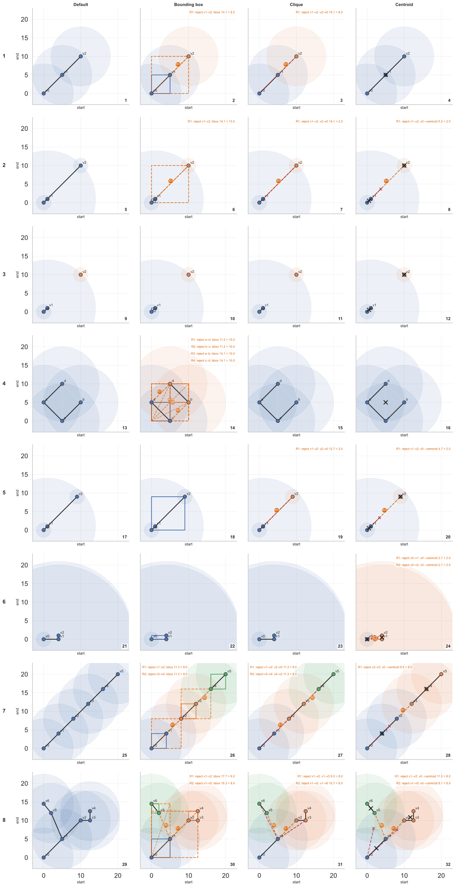

# Merge constraints

Svx forms merging clusters greedily within each `(contig, SVTYPE)` block, proposing candidate edges in internal `(start,end)` space, validates them, and then unions components (single-linkage-style connected components). Because connected components are **transitive**, svx can "chain" in dense regions (A merges with B, B merges with C, but A would not merge with C). The `--merge-constraint` parameter provides mutually-exclusive ways to restrict how clusters are allowed to grow. Note that if chaining is problematic, first try tightening distance thresholds (`--max-dist` and linear threshold settings) and keep mutual distance enabled (default; disable only with `--no-mutual-distance`). If that is not sufficient, use `--merge-constraint` modes to restrict cluster growth.

Related docs:

- [Tuning and defaults](tuning.md)
- [Full CLI reference](cli.md)

## Modes

- `none` (default): plain single-linkage-style connected components over valid edges
- `bbox_diameter`: reject merges that would make the component's `(start,end)` bounding box too large
- `clique`: reject merges unless all cross-pairs between the two components are distance-mergeable
- `centroid`: reject merges unless all members are within their own `max_dist` of the merged centroid

These modes operate on the svx **distance metric** in internal `(start,end)` space. They do **not** re-run expensive predicates (e.g., insertion sequence alignment) for every pair inside a component.

## Pairwise distance semantics

Base edge eligibility in svx is distance-thresholded. In default linear mode, each variant has
`max_dist_i = max(max_dist_linear * abs(SVLEN_i), min_dist)` (defaults: `0.5` and `100`). So for a pair `(i,j)`, with mutual distance (default): `D(i,j) = min(max_dist_i, max_dist_j)` and with `--no-mutual-distance`: `D(i,j) = max(max_dist_i, max_dist_j)`. The latter option is more permissive and can enable "hub" bridging.

## `none` (default)

Fastest and highest recall, this can over-merge via bridges due to transitivity. Use when you want maximum recall and are comfortable tuning `--max-dist` / linear threshold / other settings to control chaining.

## `bbox_diameter`

This adds an extra guard at union time. For each union-find component we maintain an axis-aligned bounding box in `(start,end)` space. Before unioning two components, svx computes the diagonal length (Euclidean diameter) of the *merged* bounding box. The merge is rejected if that diameter would exceed the edge's effective distance threshold `D(edge.from, edge.to)` (and TR-contained pairs may use `tr_max_dist`). This can help, because if a component's bounding-box diagonal is ≤ `D`, then every pair of points in that box is guaranteed to be within distance `D`. Note that `D(edge.from, edge.to)` is edge-specific and if `--no-mutual-distance` is set (or one variant has a large distance radius), a bounding box may still allow "hub" merges because the comparison is against a large `D`.

## `clique`

Before unioning two components, svx checks every cross-pair between them and rejects the union if **any** pair is not distance-mergeable (using the same `D(i,j)` semantics as normal edges, plus the TR-ID check). This strongly reduces bridging and produces tight, internally consistent clusters, at a cost of runtime (worst-case: `O(|A|·|B|)` per attempted union).

## `centroid`

Computes the centroid of the candidate merged component in `(start,end)` space and requires each variant to be within its own `max_dist` of that centroid. This can reject outlier-driven merges without paying the full cost of clique checks. It does not necessarily prevent chaining in all configurations.

## Examples

The below toy examples are meant to show how the greedy union-find clustering of svx behaves. Each variant is embedded as a point in the same internal 2D space svx uses for kNN and distance checks: `(start,end)`. Each variant has a distance radius `max_dist` (drawn as a translucent circle). From these points, we draw candidate edges whenever a pair passes the base distance gate: `dist(i,j) ≤ D(i,j)`, where `D(i,j)` is `min(max_dist_i,max_dist_j)` by default (mutual distance). If you enable `--no-mutual-distance`, `D(i,j)` becomes `max(max_dist_i,max_dist_j)`, which is more permissive and can enable "hub" behavior.

Candidate edges are processed in increasing distance order and unions components greedily. In the figure, faint gray segments are distance-eligible candidate edges, and bold black segments are the edges actually accepted by the greedy union-find. Each column corresponds to a `--merge-constraint` mode (default, bounding box, clique, centroid). When a merge is rejected by the constraint, the first rejected edge is highlighted in orange. Clique and Centroid also show a red "witness" overlay explaining *why* the constraint failed (Clique: first failing pair, Centroid: witness -> centroid).
Each row highlights specific cases:

Row 1. Three variants form a chain where `v0` is close to `v1` and `v1` is close to `v2`, but `v0` is not close to `v2`. Default single-linkage will merge all three via `v1`. Bounding box and Clique prevent this bridge and Centroid may still allow it if the centroid remains within every member's radius.

Row 2. One variant has a large radius and acts as a hub. With no mutual distance, long edges can become distance-eligible via `max(...)`, so the default behavior can chain everything into one component. Bounding box can also accept this when the merged bbox diameter stays below the edge's (large) `D(i,j)`. Clique rejects because some cross-pair in the merged component is too far (e.g., `v0–v2`). Centroid rejects if the centroid would sit outside any member's own radius.

Row 3. The same geometry as Row 2, but mutual distance is required now. The "hub" edges disappear because `D(i,j)` uses the smaller of the two radii, so long-range merges no longer pass the base distance gate. Most of the modes will produce multiple components here.

Row 4. All pairs are mutually within threshold, yet the overall bounding box diagonal can exceed that threshold. In this case Clique can accept such a "non-boxy" configuration, while Bounding box can still reject (under-merge), and be more conservative than Clique.

Row 5. With no mutual distance, a large-radius hub can make long edges eligible. Here bounding box still accepts the union because bbox diameter is below the edge-local `D(i,j)`, while Clique and Centroid reject.

Row 6. All pairwise distances are mergeable, so Clique accepts but Centroid still rejects because the merged centroid can fall outside a small-radius member's own circle.

Row 7. Default single-linkage bridges the full chain into one cluster. Clique and Bounding box split aggressively due to far cross-pairs/large merged span, while Centroid can keep larger local groups.

Row 8. A complex configuration.

